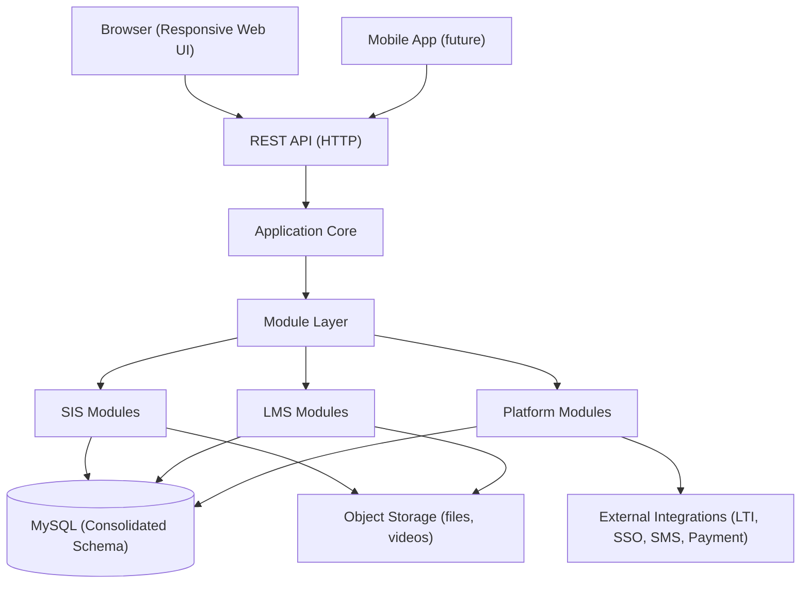

# 3. Architecture

## 3.1 Design Principles

1. **One database, one service, one UI** - no polyglot persistence; MySQL is the system of record.
2. **Modular monolith** - feature modules (LMS, SIS, Platform) share one codebase and one database, with clear internal boundaries. Evolving to microservices later is possible but not planned.
3. **Schema-first** - every feature is defined in the consolidated MySQL schema before implementation.
4. **API-first** - all functionality exposed via a REST API; the web UI consumes the same API.

## 3.2 High-Level Diagram

## 3.3 Module Layer

### SIS Modules
- `admissions`, `students`, `faculty`, `academic_structure`, `attendance`, `timetable`, `fees`, `library`, `hostel`, `transport`, `events`, `alumni`, `hr`

### LMS Modules
- `authoring`, `activities`, `quizzes`, `assignments`, `forums`, `lesson_scorm`, `video`, `gradebook`, `competencies`, `badges`, `certificates`

### Platform Modules
- `identity` (users, roles, permissions), `enrollment`, `groups`, `messaging`, `notifications`, `calendar`, `reports`, `audit`, `tenant`

## 3.4 Proposed Tech Stack

| Layer | Choice | Rationale |
|-------|--------|-----------|
| Language | PHP 8+ (native) | Moodle-compatible ecosystem, strong for LMS |
| Framework | Laravel | Modern MVC, migrations, ORM, queue, auth |
| Database | MySQL 8 | Required by user; single consolidated schema |
| Frontend | Vue 3 + Tailwind | Responsive SPA consuming REST API |
| API | REST (JSON) | Simple, universal |
| Background jobs | Laravel Queue (Redis) | Email, notifications, report generation |
| Object storage | Local/Amazon S3 | Course media, video, file submissions |
| Cache | Redis | Sessions, cache, queues |

## 3.5 Key Cross-Cutting Concerns

- **RBAC**: context-based roles (site / campus / course / class). Modeled after Moodle's `role_assignments` with context tables.
- **Tenancy**: `campus_id` and `institution_id` scoping columns on core tables.
- **Audit**: `audit_logs` table + triggers/interceptors on sensitive tables.
- **Notifications**: unified channel abstraction (in-app, email, SMS, push).
- **File handling**: central file service with permissions, watermarking, virus scan hook.

## 3.6 API Design Conventions

- Versioned: `/api/v1/...`
- Feature-scoped: `/api/v1/sis/students`, `/api/v1/lms/courses`, `/api/v1/lms/quizzes`
- Consistent error envelope: `{ "error": { "code": "...", "message": "..." } }`
- Pagination: `?page=&per_page=` returning `{ data, meta }`
