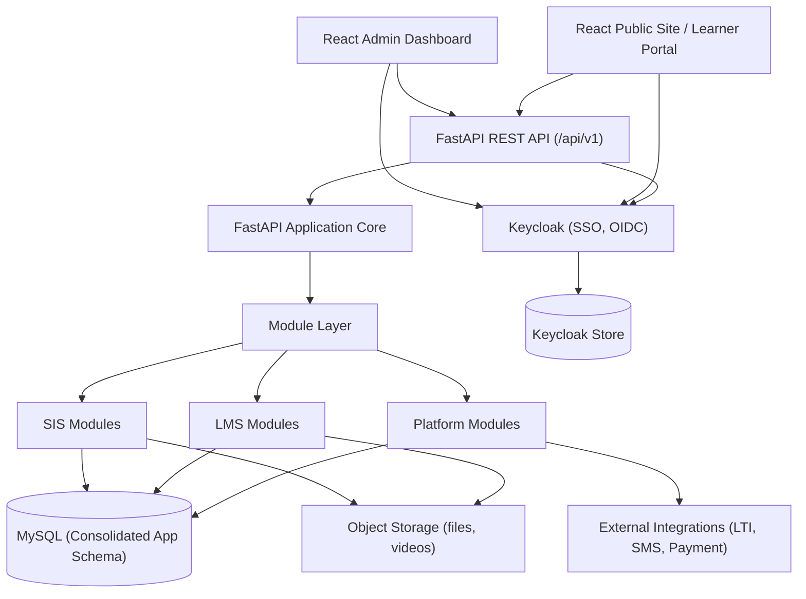

# 3. Architecture

## 3.1 Design Principles

1. **Three-tier separation** - presentation (React), application (FastAPI), data (MySQL). Each tier scales and deploys independently.
2. **Identity is external** - Keycloak owns authentication and SSO; the application never stores passwords.
3. **Modular monolith backend** - feature modules (LMS, SIS, Platform) share one FastAPI codebase and one database, with clear internal boundaries.
4. **Schema-first** - every feature is defined in the consolidated MySQL schema before implementation.
5. **API-first** - all functionality exposed via a REST API; both React apps consume the same API.

## 3.2 High-Level Diagram



## 3.3 The Three Tiers

| Tier | Component | Tech | Responsibility |
|------|-----------|------|----------------|
| **1. Presentation** | Admin Dashboard | React 18 + Tailwind CSS (`admin/`) | Admin/staff operations (SIS + LMS admin) |
| **1. Presentation** | Public Site / Learner Portal | React 18 + Tailwind CSS (`frontend/`) | Learner-facing (courses, grades, fees, portal) |
| **2. Application** | Backend | FastAPI (Python 3.11+) | REST API, business logic, RBAC enforcement |
| **3. Data** | App database | MySQL 8 | Consolidated LMS + SIS schema |
| **3. Data** | Identity store | Keycloak-managed DB | Users, credentials, roles, sessions, SSO |

## 3.4 Module Layer (FastAPI)

```
backend/
├── app/
│   ├── api/v1/
│   │   ├── sis/          # students, admissions, attendance, fees, timetable, ...
│   │   ├── lms/          # courses, activities, quizzes, gradebook, ...
│   │   └── platform/     # enrollment, groups, messaging, calendar, reports, ...
│   ├── core/             # config, security, RBAC dependencies, auditing
│   ├── db/               # SQLAlchemy models, migrations (Alembic)
│   ├── schemas/          # Pydantic request/response models
│   ├── services/         # business logic
│   └── main.py
admin/                    # React admin dashboard
frontend/                 # React public site / learner portal
keycloak/                 # Keycloak realm config
db/                       # consolidated schema + source scripts
```

### Backend modules
- **SIS**: `admissions`, `students`, `faculty`, `academic_structure`, `attendance`, `timetable`, `fees`, `library`, `hostel`, `transport`, `events`, `alumni`, `hr`
- **LMS**: `authoring`, `activities`, `quizzes`, `assignments`, `forums`, `lesson_scorm`, `video`, `gradebook`, `competencies`, `badges`, `certificates`
- **Platform**: `identity`, `enrollment`, `groups`, `messaging`, `notifications`, `calendar`, `reports`, `audit`, `tenant`

## 3.5 AuthN / AuthZ: Keycloak + RBAC

- **SSO**: Keycloak (OIDC) is the single identity provider. All apps redirect to Keycloak for login.
- **Flow**: Browser -> Keycloak login -> access token (JWT) -> React apps attach `Authorization: Bearer <jwt>` to FastAPI calls.
- **Backend validates** JWT signatures (JWKS from Keycloak) on every request; user claims give the subject id.
- **RBAC**:
  - *Realm-level roles* in Keycloak map to coarse access (admin, staff, teacher, student, parent).
  - *Context-based permissions* live in the app DB (Moodle-style): `contexts`, `roles`, `permissions`, `user_roles` tables grant scoped access per campus/course/class.
  - FastAPI dependencies (`require_roles`, `require_permission`) enforce on each endpoint.
- **Client apps**: one Keycloak client for dashboard, one for public site; audiences scoped per app.

## 3.6 Proposed Tech Stack

| Layer | Choice | Rationale |
|-------|--------|-----------|
| Language | Python 3.11+ | FastAPI-native, async, strong typing |
| API framework | FastAPI | Auto OpenAPI docs, Pydantic validation, async |
| ORM | SQLAlchemy 2.0 + Alembic | Migrations, model-first schema |
| Identity / SSO | Keycloak (OIDC) | External IdP, realm roles, self-service |
| Database | MySQL 8 | Consolidated app schema (user requirement) |
| Keycloak store | Separate DB (managed by Keycloak) | Isolation from app data |
| Dashboard | React 18 + Tailwind CSS (`admin/`) | Admin/staff SPA |
| Public site | React 18 + Tailwind CSS (`frontend/`) | Learner portal / public site |
| Background jobs | Celery + Redis | Email, notifications, report generation |
| Object storage | Local/Amazon S3 | Course media, video, file submissions |
| Cache | Redis | Cache, sessions, job broker |

## 3.7 Key Cross-Cutting Concerns

- **RBAC**: coarse roles from Keycloak JWT + context-based permissions in app DB.
- **Tenancy**: `campus_id` and `institution_id` scoping columns on core tables.
- **Audit**: `audit_logs` table + service-layer interceptors on sensitive tables.
- **Notifications**: unified channel abstraction (in-app, email, SMS, push).
- **File handling**: central file service with permissions, watermarking, virus scan hook.

## 3.8 API Design Conventions

- Versioned: `/api/v1/...`
- Feature-scoped: `/api/v1/sis/students`, `/api/v1/lms/courses`, `/api/v1/lms/quizzes`
- Consistent error envelope: `{ "error": { "code": "...", "message": "..." } }`
- Pagination: `?page=&per_page=` returning `{ data, meta }`
- Auth: `Authorization: Bearer <JWT>` validated against Keycloak JWKS
