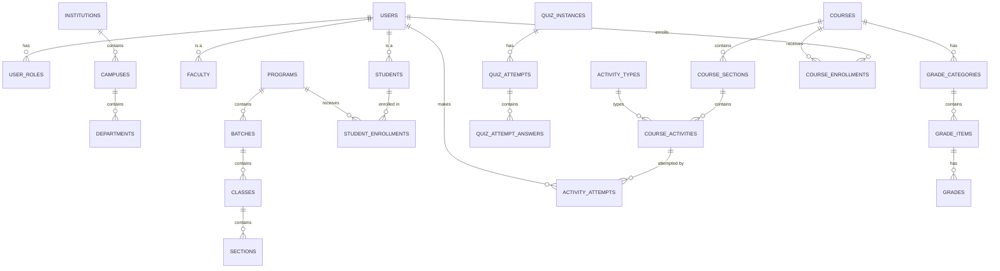

# 4. Consolidated MySQL Database Schema

## 4.1 Strategy

We do **not** copy the raw SQL of Moodle, OpenEduCat, or Open edX. Instead we design a **canonical schema** that absorbs the strongest conceptual model from each source, then migrate each source's data into it.

| Source Model | Adopted Concept |
|--------------|-----------------|
| Moodle | Activity engine, context-based roles, gradebook aggregation |
| OpenEduCat | Academic structure (institution -> campus -> department -> program -> batch -> class -> section), fee ledger |
| Open edX | Course authoring hierarchy (course -> section -> unit -> component) |

> The user will also provide the original DB scripts (OpenEduCat, Open edX, Moodle) under `db/source/` and a consolidated script under `db/consolidated/`. This document defines the target consolidated schema.

## 4.2 Naming Conventions

- Tables: `snake_case`, plural where they hold multiple records (e.g., `students`, `course_activities`).
- Primary keys: `BIGINT UNSIGNED AUTO_INCREMENT` named `<table>_id` unless inherited via FK.
- Foreign keys: `<referenced_table>_id`.
- Timestamps: `created_at`, `updated_at`; soft delete via `deleted_at`.
- Every core table carries tenant scoping: `institution_id` (or `campus_id`) where applicable.

## 4.3 Core Domain Groups

### Identity & Access
| Table | Purpose |
|-------|---------|
| `users` | Auth, profile, contact |
| `roles` | Role definitions (student, teacher, admin, parent, staff) |
| `permissions` | Granular permission catalog |
| `role_permissions` | Role <-> permission mapping |
| `user_roles` | Context-based role assignments (context table + context_id) |
| `contexts` | Site / campus / course / class context hierarchy |

### Academic Structure (SIS)
| Table | Purpose |
|-------|---------|
| `institutions` | Top-level tenant |
| `campuses` | Campus within institution |
| `departments` | Academic departments |
| `programs` | Programs offered (e.g., B.Sc CS) |
| `batches` | Cohort batch per program |
| `classes` | A class/batch-section |
| `sections` | Sections within class |
| `academic_terms` | Term/semester/year definitions |
| `subjects` | Subjects offered |
| `class_subjects` | Subject mapping per class + term + teacher |

### Students & Faculty (SIS)
| Table | Purpose |
|-------|---------|
| `students` | Student profile, linked to `users` |
| `student_admissions` | Admission applications, status, offer |
| `student_documents` | Uploaded documents |
| `guardians` | Parent/guardian info |
| `student_guardians` | Many-to-many students <-> guardians |
| `faculty` | Staff/faculty profile linked to `users` |
| `faculty_contracts` | Contracts, terms, status |
| `student_enrollments` | Enrollment in academic program/term (SIS side) |

### Attendance & Timetable (SIS)
| Table | Purpose |
|-------|---------|
| `attendance` | Per student per date/period status |
| `attendance_settings` | Workday, holidays, grace period |
| `timetables` | Class schedule entries |
| `timetable_slots` | Period definitions |
| `rooms` | Room/venue registry |

### Fees (SIS)
| Table | Purpose |
|-------|---------|
| `fee_structures` | Fee head definitions per program |
| `fee_structure_items` | Individual fee line items |
| `student_fee_assignments` | Fees assigned to a student |
| `fee_invoices` | Generated invoices |
| `fee_payments` | Payments, installments, receipts |
| `fee_transactions` | Ledger entries (payment, refund, adjustment) |

### Library, Hostel, Transport (SIS)
| Table | Purpose |
|-------|---------|
| `library_books` | Catalog |
| `library_memberships` | Borrowing eligibility |
| `library_loans` | Issue/return/fine |
| `hostel_rooms` | Room inventory |
| `hostel_allocations` | Student room assignments |
| `transport_routes` | Routes |
| `transport_stops` | Stops per route |
| `transport_assignments` | Student/route/stop assignment |

### Course Authoring (LMS, Open edX model)
| Table | Purpose |
|-------|---------|
| `courses` | Course definitions |
| `course_sections` | Course sections/modules |
| `course_units` | Units within a section |
| `course_components` | Content components (video, text, activity reference) |

### Activity Engine (LMS, Moodle model)
| Table | Purpose |
|-------|---------|
| `activity_types` | Registry of pluggable activities |
| `course_activities` | Instances of activities inside a course section |
| `activity_configs` | Per-instance configuration (JSON) |
| `activity_attempts` | Student attempts per activity |
| `activity_results` | Graded outcome per attempt |

### Quizzes (LMS, Moodle model)
| Table | Purpose |
|-------|---------|
| `question_bank` | Question pool |
| `question_categories` | Category tree |
| `question_versions` | Versioning of questions |
| `quiz_instances` | Quiz activity instances |
| `quiz_questions` | Question selection per quiz |
| `quiz_attempts` | Student quiz attempts |
| `quiz_attempt_answers` | Per-question answers + marks |

### Gradebook (LMS, Moodle model)
| Table | Purpose |
|-------|---------|
| `grade_categories` | Gradebook categories per course |
| `grade_items` | Gradeable items |
| `grades` | Raw grade per user per item |
| `grade_histories` | Grade change history |
| `gradebook_settings` | Aggregation rules (weighted, sum, mean) |

### Competencies, Badges, Certificates (LMS)
| Table | Purpose |
|-------|---------|
| `competency_frameworks` | Framework definitions |
| `competencies` | Competencies within frameworks |
| `learning_plans` | Plan definitions |
| `learning_plan_competencies` | Mapping |
| `badge_definitions` | Badge rules |
| `badge_awards` | Awarded badges |
| `certificate_templates` | Certificate layout |
| `certificates` | Issued certificates |

### Forums, Messaging, Calendar (LMS + Platform)
| Table | Purpose |
|-------|---------|
| `forum_discussions` | Discussion threads |
| `forum_posts` | Posts/replies |
| `messages` | Private messaging |
| `message_recipients` | Delivery + read state |
| `notifications` | Generated notifications |
| `calendar_events` | Institution/course/personal events |

### Enrollment & Groups (LMS)
| Table | Purpose |
|-------|---------|
| `course_enrollments` | User <-> course with role + status |
| `cohorts` | Site/tenant cohorts |
| `cohort_members` | Cohort membership |
| `groups` | Course groups |
| `group_members` | Group membership |

### Reporting & Audit (Platform)
| Table | Purpose |
|-------|---------|
| `reports` | Saved report definitions |
| `report_runs` | Report execution history |
| `audit_logs` | Sensitive data change tracking |
| `sessions` | Auth sessions |
| `tokens` | API tokens |

## 4.4 Key Relationships (Mermaid ER Overview)

## 4.5 Migration Strategy

1. **Source scripts preserved**: `db/source/openeducat.sql`, `db/source/openedx.sql`, `db/source/moodle.sql` - kept as reference (user-provided).
2. **Consolidated schema**: `db/consolidated/schema.sql` - canonical target, generated from this design.
3. **Migration tooling** (later phase): per-source extractors map each source table to target tables.
4. **Seed data**: base roles, permissions, activity types, fee heads, demo institution.
5. **Versioning**: migrations managed by the application framework (Laravel Migrations) in `db/migrations/`.

## 4.6 Indexing & Integrity Notes

- Unique keys on natural lookups (e.g., `students(user_id)`, `user_roles(user_id, context_id, role_id)`).
- Composite indexes on high-traffic FKs (e.g., `course_enrollments(course_id, user_id)`, `grades(user_id, grade_item_id)`).
- `ON DELETE CASCADE` for child-only tables (e.g., `quiz_attempt_answers`); `RESTRICT` for business-critical FKs (e.g., fee ledger).
- `InnoDB` engine, `utf8mb4` charset, foreign key checks enabled.
