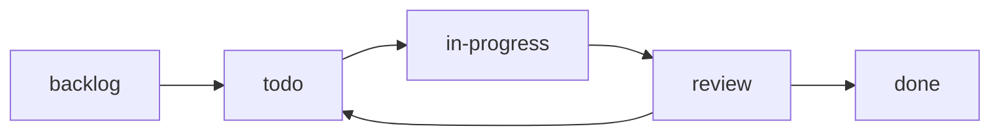

# 7. Task Management System

Systematic task tracking for a **scalable number of agent harnesses** working on one repo. The system is designed so adding agents never requires restructuring — you just register the agent and assign it a workstream scope.

## 7.1 Core Idea

- Every unit of work is a **task** with a unique ID.
- Tasks live in the `tasks/` registry (plain markdown files, git-tracked).
- Each task has a **single owner agent** and a **workstream scope**.
- **`tasks/` is human-owned (read-only for agents)**, same as `docs/`. Agents do not create/edit tasks; the orchestrator does.

## 7.2 Task ID Scheme

Format: `<AREA>-<NNN>` (area = 3-letter workstream code, number = 3-digit sequence).

```
SIS-001   LMS-002   PLT-003   DB-004   FE-005
```

| Area | Workstream | Owner (default) |
|------|-----------|-----------------|
| SIS | SIS core (backend) | Agent A |
| LMS | LMS core (backend) | Agent B |
| PLT | Platform + frontend | Agent C |
| DB | Database + identity | Agent D |
| FE | Frontend (shared UI work) | Agent C |

> Adding a new agent: pick a new area code (e.g., `QA`, `DOC`, `INFRA`) and register it in the registry below. No structural change needed.

## 7.3 Task File Format

One markdown file per area in `tasks/`, e.g., `tasks/SIS.md`. Each task is a bullet block:

```md
### SIS-001: Admissions API - create application
- **Status**: [ ] backlog | [x] todo | [ ] in-progress | [ ] review | [x] done
- **Priority**: P0
- **Owner**: Agent A
- **Depends on**: DB-001
- **Scope**: backend/app/api/v1/sis/admissions.py
- **Acceptance**: POST /api/v1/sis/admissions creates an application, validates input, enforces RBAC.
```

**Status values** (only one active):
- `backlog` - queued, not started
- `todo` - ready to be picked up
- `in-progress` - assigned and being worked
- `review` - PR opened, awaiting review
- `done` - merged and verified

## 7.4 Task Lifecycle



1. Orchestrator creates tasks from the roadmap (docs/05) into `tasks/`.
2. Orchestrator moves a task to `todo` and assigns an owner.
3. Agent picks up its `todo` tasks (prefixed by its area), marks `in-progress`, does the work on its branch.
4. Agent opens PR; orchestrator marks `review`.
5. On merge + verification, orchestrator marks `done`.

## 7.5 Agent Registry (scalable)

```md
| Agent ID | Harness | Area code(s) | Branch prefix | Model |
|----------|---------|--------------|---------------|-------|
| A | Claude Code | SIS | 260807-feat-sis-core | Claude |
| B | Codex | LMS | 260807-feat-lms-core | GPT |
| C | opencode | PLT, FE | 260807-feat-platform | Cloud LLM |
| D | PI Coder | DB | 260807-feat-db-schema | Devstral local |
```

**To add an agent**: append a row, assign area codes, and create/own the matching task files. No other changes.

## 7.6 Coordination Rules

1. **One owner per task.** Never two agents on the same task ID.
2. **No unassigned `in-progress`.** Every in-progress task has exactly one agent.
3. **Dependencies** (`Depends on`) must be `done` before a task starts.
4. **PR title format**: `<AREA>-<NNN>: <summary>` (e.g., `SIS-001: add admissions API`).
5. Cross-cutting decisions (auth, response envelope, table names) are decided once in docs and frozen; agents file a new task to change them.

## 7.7 Definition of Done (reused from docs/06)

- Task's acceptance criteria all met.
- Migrations + seeds included where relevant.
- Lint and tests pass.
- Branch pushed, PR opened with `<AREA>-<NNN>` title, no out-of-scope file changes.
- Orchestrator marks `done` only after merge.
