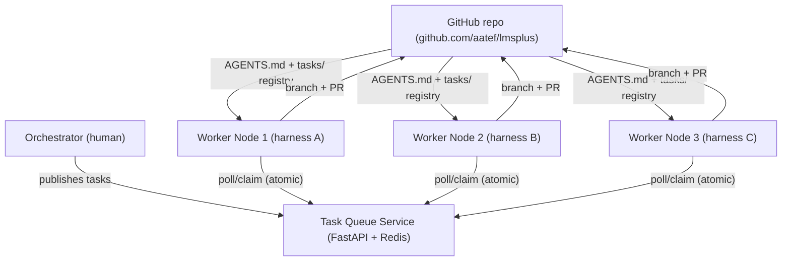
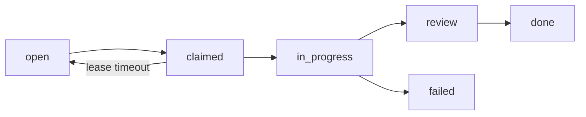

# 8. Worker Pool - Autonomous Pull Execution

Design for a fleet of **independent worker machines**, each running a capable local model harness, that join the project pool and autonomously pull and complete tasks one after another.

## 8.1 Goal

Any worker node can join at any time and immediately start executing tasks with **zero manual assignment**. A central queue guarantees a task is claimed by exactly **one** worker at a time (atomic claim), and the node keeps pulling new tasks after finishing its current one.

## 8.2 Components



## 8.3 Task Queue Service

A small **FastAPI service backed by Redis**, the single source of truth for task claiming at runtime. The git-tracked `tasks/*.md` registry (docs/07) remains the human-authored source; the queue service is populated from it and adds runtime state (claim leases, owner, status).

### Data model (per task)

| Field | Type | Notes |
|-------|------|-------|
| `id` | string | `AREA-NNN` (e.g., `PLT-001`) |
| `area` | string | `SIS`, `LMS`, `PLT`, `FE`, `DB`, `QUE` |
| `status` | enum | `open` / `claimed` / `in_progress` / `review` / `done` / `failed` |
| `priority` | int | P0=1 ... P2=3 |
| `depends_on` | list | task IDs that must be `done` first |
| `owner` | string | worker id currently holding the lease |
| `lease_expiry` | timestamp | auto-release if worker dies |
| `branch` | string | worker-created branch name |
| `acceptance` | string | from tasks/*.md |
| `version` | int | optimistic-lock counter for CAS claims |

### Claim algorithm (atomic, race-free)

1. Worker asks `POST /tasks/claim` with its worker-id and desired `areas`.
2. Server picks the **highest-priority, oldest `open`** task in those areas whose `depends_on` are all `done`.
3. **Atomic transition** using Redis `WATCH/MULTI` or a Lua script:
   - check task is `open`
   - set status=`claimed`, owner=worker, lease_expiry=now+TTL
   - increment `version`
4. Only one worker's CAS succeeds; losers get `409 Conflict` and immediately retry for the next task.

### Lease & heartbeat

- Claim grants a lease (default **10 min**). Worker sends `POST /tasks/{id}/heartbeat` every 2 min to extend.
- If lease expires (crashed worker), task returns to `open` automatically for re-claim.
- Tasks in `failed` state are not re-claimed without orchestrator review (avoids infinite retry loops).

### API surface

| Method | Path | Purpose |
|--------|------|---------|
| POST | `/tasks/claim` | Atomically claim next available task for `areas` |
| POST | `/tasks/{id}/heartbeat` | Extend lease |
| POST | `/tasks/{id}/complete` | Mark done (+ branch/PR url) |
| POST | `/tasks/{id}/fail` | Mark failed with reason |
| GET | `/tasks` | List + status filter (dashboard) |
| POST | `/tasks/sync` | Re-sync from git-tracked `tasks/*.md` |

## 8.4 Worker Node Client

A thin client (`worker/` folder in repo) runs on every machine. It is **harness-agnostic**: the actual coding is delegated to the local harness (opencode, Claude Code, Codex, PI Coder). The client only orchestrates: claim -> run harness -> push PR -> report.

### Worker loop

```
while True:
    task = claim(worker_id, areas)          # poll until a task is free
    branch = checkout_task_branch(task.id)  # git fetch origin main; checkout -b
    result = run_harness(task)              # invoke local harness on task description
    if result.success:
        push_branch_and_open_pr(task, branch)
        complete(task, pr_url)
    else:
        fail(task, reason)
    # loop immediately pulls the next task
```

### Harness invocation (heterogeneous)

- `worker.yaml` per node: `harness: opencode|claude|codex|pi`, plus model settings.
- The client renders the task (title, scope, acceptance, area) into a prompt file (`task.md`) and calls the harness CLI headlessly (non-interactive mode) on the checked-out branch.
- The harness reads `AGENTS.md` for shared rules and produces a branch with the change.

### Provisioning a new node (any time)

```
git clone https://github.com/aatef/lmsplus.git
pip install -r worker/requirements.txt
cp worker/worker.example.yaml worker.yaml   # set harness, areas, queue URL
python worker/worker.py
```

The node joins the pool and starts pulling tasks immediately. **No orchestrator action needed.**

## 8.5 Branch & PR Protocol

- One branch per task: `260809-task-<AREA>-<NNN>` (e.g., `260809-task-PLT-001`).
- Branch from latest `origin/main`; push; open PR titled `<AREA>-<NNN>: <summary>`.
- PR description embeds the task acceptance criteria for human review.
- Worker marks task `complete` after PR is pushed (merge review remains with the human orchestrator).
- Read-only files (`docs/`, `tasks/`, `AGENTS.md`, manifests) are never modified by workers.

## 8.6 Task States (runtime)



## 8.7 Orchestrator Responsibilities

- Publish tasks to the queue from `tasks/*.md` (via `/tasks/sync`).
- Review + merge PRs; merge updates the git registry status to `done`.
- Monitor `/tasks` dashboard; re-open `failed` tasks after triage.
- Decide priorities and dependencies.

## 8.8 Scaling Rules

- **Any node can join anytime**: no pre-registration; client identifies by self-assigned `worker_id`.
- **Node areas**: a node restricts itself via `areas` in `worker.yaml` (e.g., a node only doing `DB` tasks). Default: all areas.
- **Node count**: only one worker may hold a given task due to atomic claim; nodes simply compete for remaining `open` tasks.
- **Heterogeneous harnesses**: nodes run whatever local model/harness is installed; each reads the same `AGENTS.md` and task prompt.
